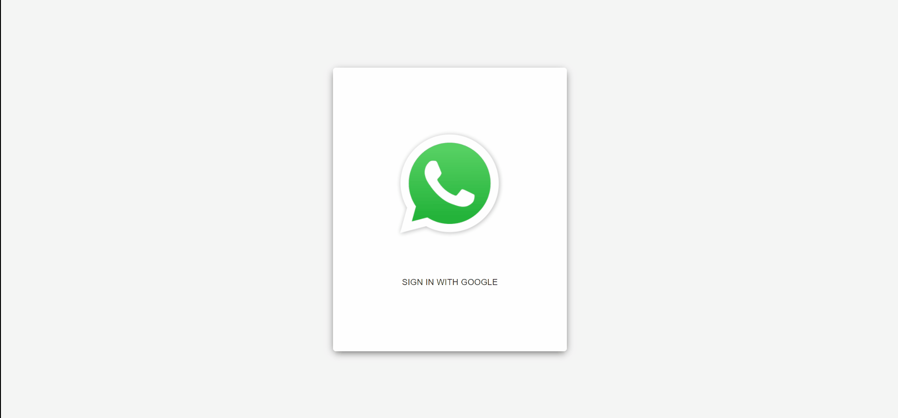

# Whatsapp 2.0

A simple Whatsapp made using Nextjs, React, styled components and Firebase.

## Demo

 
 

## Technologies used

- Nextjs, React Hooks, Firebase, Material UI, Styled Components

## Getting Started

- Fork and clone this repository
- Setup firebase and auth
- Run `yarn && yarn start` or `npm i && npm start`
